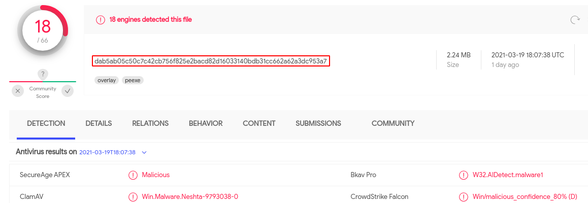
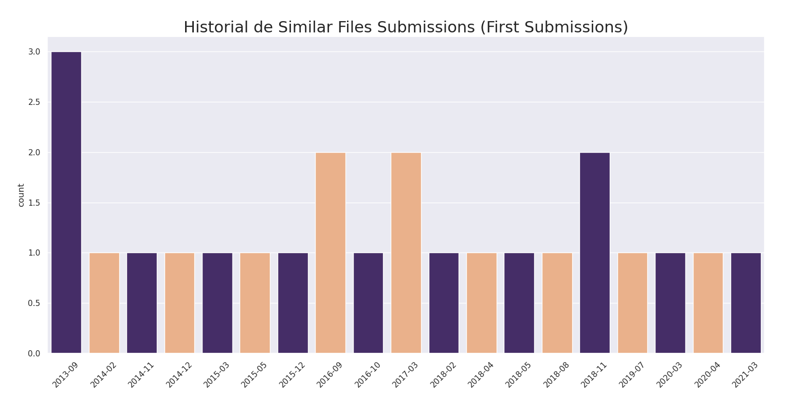

Quick script to plot a timeline of First Submissions file dates similar to the hashed file provided as script argument.

Suppose we have a SHA-256 from a malware sample.



We could quickly get a timeline of similar files's first submissions in VT.

```bash
python3 plot_submissions_timeline.py apikey hash [year|month|day]
```
This generates the following as output.


